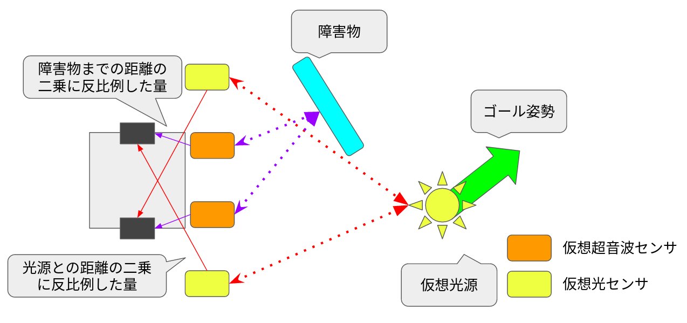

# Braitenberg Vehicleを作ろう！

## Braitenberg Vehicleとは？
Braitenberg Vehicleはセンサをモータに直結して作られたロボットです。  
非常に単純な構造をしていますが、障害物回避といった実環境に適応した動きが実現できます。  

Turtlebot3のセンサはモーターに直結していませんが、センサ値から仮想的なモータ司令を生成し、そこから速度司令を計算することで擬似的にBraitenberg Vehicleを再現してみましょう。  

pythonでの実装例が[こちらの記事](https://qiita.com/domutoro406/items/c52892b5afd2de34d0fd)に載っています。  
今回のハンズオンでは、障害物を避けながらゴール地点へ向かう3号cを作っていきます。  

それでは、パッケージを作っていきましょう。

```bash
cd /home/ubuntu/Desktop/colcon_ws/src/ros_handson_packages
ros2 pkg create braitenberg_vehicle --dependencies rclcpp rclcpp_components ament_cmake_auto geometry_msgs sensor_msgs tf2_ros tf2_geometry_msgs --library-name braitenberg_vehicle_controller --license Apache-2.0
```

このコマンドを実行すると`braitenberg_vehicle`という名前のROS2パッケージが出来上がります。

パッケージが出来上がったら、test_dependを変更するために[package.xml](https://github.com/OUXT-Polaris/ros_handson_packages/blob/master/braitenberg_vehicle/package.xml)をコピーしてください。

その他のソースコードもコピーする必要があります。
[includeディレクトリの中身](https://github.com/OUXT-Polaris/ros_handson_packages/tree/master/braitenberg_vehicle/include)、[srcディレクトリの中身](https://github.com/OUXT-Polaris/ros_handson_packages/tree/master/braitenberg_vehicle/src)、[launchディレクトリの中身](https://github.com/OUXT-Polaris/ros_handson_packages/tree/master/braitenberg_vehicle/launch)、[configディレクトリの中身](https://github.com/OUXT-Polaris/ros_handson_packages/tree/master/braitenberg_vehicle/config)もコピーしてください。
最後に[CMakeLists.txt](https://github.com/OUXT-Polaris/ros_handson_packages/blob/master/braitenberg_vehicle/CMakeLists.txt)をコピーすれば準備完了です。

本来のBraitenberg Vehicle3号には超音波センサと光センサが搭載されていますが、TurtleBot3には搭載されていません。  
そこで今回はソフトウェアである程度等価な処理を実装してみました。



それぞれのセンサのシミュレーション方法は以下のようになっています。

## 仮想光センサのシミュレーション

仮想光センサはゴール姿勢のトピックからゴール地点の座標$P$をセンサから見た座標系で取得します。

$$
P = (P_x, P_y , P_z)
$$

次に、この座標Pが視界の範囲に入っているかを確認します。
この計算にはarctangentを使用します。
ロボットのパスプランニングの文脈でarctangentを使用するときには必ずatanではなくatan2を使用しましょう。
値がぶっ飛んで大変なことになります。

$$
\theta = \arctan2(P_y, P_x)
$$

θの値が視界の値を超えている場合は0,視界内にある場合は距離の二乗に反比例した値をセンサの出力とします。

$$
m_l = 0  (\theta < -\theta_{limit}, \theta_{limit} < \theta)
$$

$$
m_l = 1 / (P_x^2 + P_y ^2 + P_z^2) ^ 2  (-\theta_{limit} \leqq \theta \leqq \theta_{limit})
$$

この式から得られた結果が1を超えた場合、最終的な出力は1となります。

## 仮想超音波センサのシミュレーション

次に、仮想超音波センサのシミュレーション方法について説明します。
このシミュレーションには、laserscanの結果を使用します。  
まず、laserscanの点群をセンサから見た座標系に変換します。
その結果得られた点群を仮想光センサと同様の手順で座標変換し、視界の範囲内に入った点群をすべてリストアップします。
視界に入った点群$P_n$に対して以下の処理をします。

$$
P_n = (P_{x0}, P_{y0} , P_{z0}), (P_{x1}, P_{y1} , P_{z1}) ... (P_{xn}, P_{yn} , P_{zn})
$$

まず、すべての点に対して距離を計算し、距離が近いものだけをフィルターします。
フィルターした結果何も残らない場合は超音波センサの出力$m_u$は0となります。

それ以外の場合は最も距離が近い点$P_i=(P_{xi}, P_{yi} , P_{zi})$に対して
以下の計算式を適用し、超音波センサの出力を計算します。

$$
m_u = 1 / (P_{xi}^2 + P_{yi} ^2 + P_{zi}^2) ^ 2 
$$

## モータコマンドの生成

最後に、2つのセンサ出力を統合します。

左の仮想光センサ出力を$m_{ll}$、右の仮想超音波センサ出力$m_{ru}$
左側のモータのモータコマンド$M_l$は以下の式で計算されます。

$$
M_l = m_{ll} * gain_l + m_{ru} * gain_u
$$

ここで、$gain_l$は仮想光センサからのゲイン、$gain_u$は仮想超音波センサからのゲインです。

左の仮想光センサ出力を$m_{rl}$、右の仮想超音波センサ出力$m_{lu}$
左側のモータのモータコマンド$M_r$は以下の式で計算されます。

$$
M_r = m_{rl} * gain_l + m_{lu} * gain_u
$$

## 実際に車両を動かしてみよう

実際に動作する様子を確かめてみましょう。
ターミナルを立ち上げて以下のコマンドを実行します。

まずはパッケージ群をビルドします。

```bash
cd /home/ubuntu/Desktop/colcon_ws
colcon build --symlink-install
```

次にシミュレータを起動します。

```bash
ros2 launch turtlebot3_gazebo turtlebot3_world.launch.py
```

次に、rvizと制御系を立ち上げます。

```bash
ros2 launch braitenberg_vehicle controller.launch.xml
```

rviz上でgoal poseツールを使ってゴール姿勢を指定してみましょう！そこに向かって車両が進んでいくはずです。

<iframe width="1280" height="720" src="https://www.youtube.com/embed/KPfsGCKQZkA" title="YouTube video player" frameborder="0" allow="accelerometer; autoplay; clipboard-write; encrypted-media; gyroscope; picture-in-picture; web-share" allowfullscreen></iframe>
