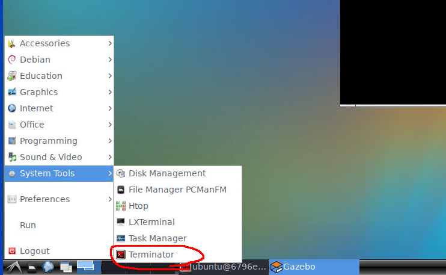

# Windows での Docker のセットアップ

windows 10 での docker のインストール方法についての簡単な説明です。

## 1. Docker Desktop for Windows のインストール

https://docs.docker.jp/docker-for-windows/install.html
を参照して DockerDesktop をインストールしましょう。


Docker Hub からダウンロードをクリック


ダウンロードしたらこんな感じです
。


Docker Desktop Installer.exe をクリックするとインストーラーが立ち上がります。


OK を押して進めましょう。


ここまで来たら再起動しましょう。

再起動後、こんな画面が出ると思います。


Accept を押したら完了です。

もしかしたら wsl のアップデートをしてくれと言われる場合も有ります。そしたら、PowerShell に

```
wsl --update
```

を入力してアップデートしましょう。


Docker Desktop が起動するとこんな感じの画面になります。


# イメージのダウンロード

Docker image をダウンロードします。

```
docker run --rm -p 6080:80 --shm-size=4096m --security-opt seccomp=unconfined ghcr.io/ouxt-polaris/ros_handson/ros_handson:latest
```

このコマンドをコピーして PowerShell に入力してください。


ダウンロードが始まるとこんな感じです。


ダウンロードが終わるとイメージが起動して、127.0.0.1:6080 に接続できるようになります。

gazebo を起動するためのターミナルはここにあります。


# その他

イメージをストップするには Docker Desktop の画面で停止マークを押します。


もう一度起動するには再度 PowerShell で

```
docker run --rm -p 6080:80 --shm-size=4096m --security-opt seccomp=unconfined ghcr.io/ouxt-polaris/ros_handson/ros_handson:latest
```

を入力すれば良いです。起動にはちょっと時間がかかります。

# 参考文献

https://github.com/AI-Robot-Book/chapter1/tree/main/docker
