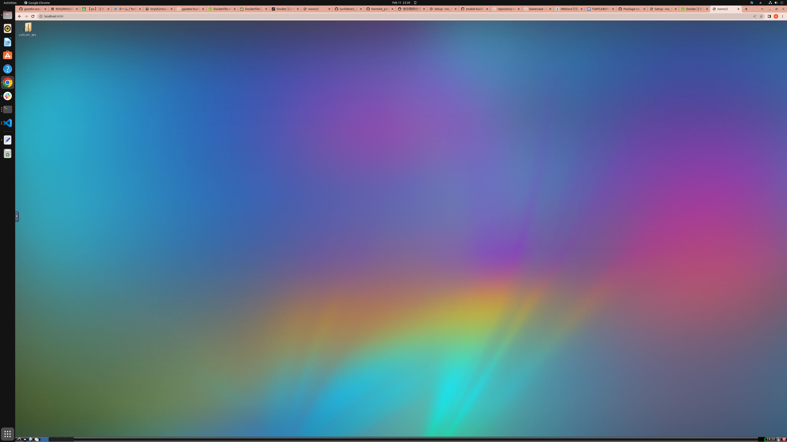
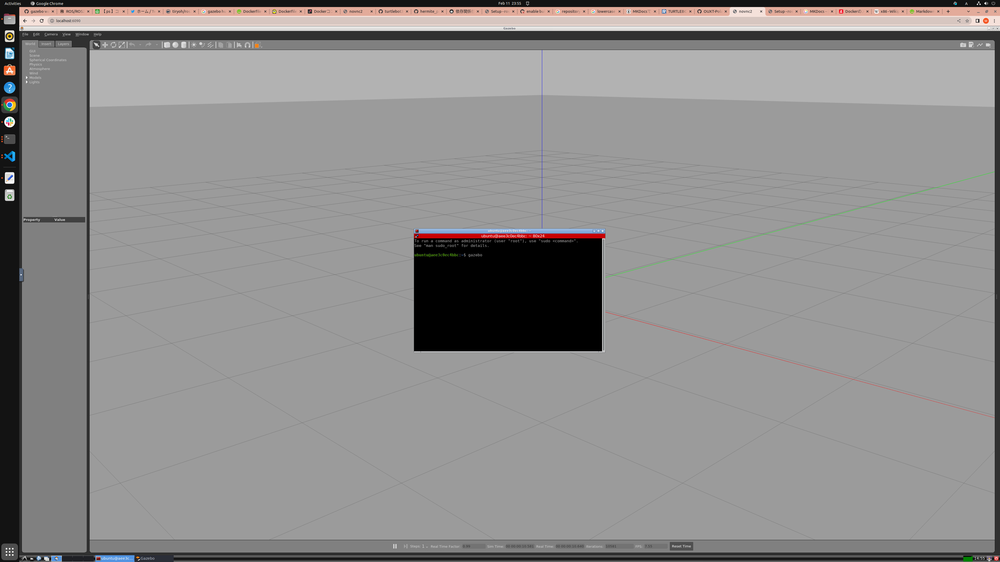

# セットアップ方法

本教材では、トラブルを避けるためDockerで環境構築を行います。
そのため、事前にDockerのインストールを済ませておいてください。

Dockerのインストール手順は[こちら](https://docs.docker.com/engine/install/ubuntu/)

!!! note
    Dockerはインストール直後だとsudoをつけないと動かないです。
    インストール後必ず以下のコマンドを実行し、PCの再起動を行ってください
    
    ```
    sudo gpasswd -a $USER docker
    ```
    
    以下のコマンドを入力して
    
    ```
    docker run hello-world
    ```

    `Hello from Docker!`を含む出力が得られていればDockerのインストールは正常に完了しています。


!!! warning
    本教材を執筆するにあたって筆者が使用している環境は`Ubuntu22.04`です。  
    Dockerが動けば他のOSでも動く可能性はあるとは思います。  
    ただしM1 Macなどの非x86系CPUの上だと多分動かないです。  


Dockerはソフトウェアの動作似必要なライブラリ群を一つにまとめ、共有できる仕組みです。  
あたかも仮想マシンのように(厳密にはコンテナ仮想化といいます)振る舞い、`docker pulll`や`docker run`といったコマンドを叩くだけでかんたんに環境を再現することができます。　　
このとき、動作環境に必要なファイルを一つにまとめたものを「Docker Image」、そのファイルから作られた動作環境のことを「Docker Container」といいます。
一つのDocker Imageから複数のDocker Containerを作って同時に動かすことも可能です。
Docker Imageが本体、Docker Containerが分身という関係性あると考えるとわかりやすいかもしれません。

## Docker imageの起動

Docker Imageはgithub actionsというツールを使用して自動的にビルドされgithub container registryにおいてあります。
そのためビルドする必要はありません。
github actionsはgithubで開発を行うときに使用できる非常に強力なCI/CDツールで皆さんの競技活動、研究活動を大きく効率化してくれますので、付録に使い方を載せておきます。

```bash
docker run --rm -p 6080:80 --shm-size=4096m --security-opt seccomp=unconfined ghcr.io/ouxt-polaris/ros_handson/ros_handson:latest
```

ブラウザで以下のURLを開いてください [http://127.0.0.1:6080/](http://127.0.0.1:6080/)
VNCが立ち上がるので、ブラウザからDocker Conteiner内部の環境にアクセスすることができます。



こちらの環境にはすでに必要なソフトウェアがインストールされていますので、vnc上でシェルを立ち上げて

```bash
gazebo
```

と入力するとgazeboが立ち上がります。



!!! warning
    円滑な開催のため、ハンズオン会場に来られる前にここまでは必ず動作確認をお願いします。  

今回はこの環境使ってハンズオンを進めていこうとおもいます。

## VScodeのインストール

こちらはマストではありませんが、あれば非常に楽です。  
今回のハンズオンでは基本的にVNC上で操作は完結しますが、Docker Containerに接続しデータをコピーしたりすることができるため、[VSCode](https://azure.microsoft.com/ja-jp/products/visual-studio-code)
および[DevContainerプラグイン](https://marketplace.visualstudio.com/items?itemName=ms-vscode-remote.remote-containers)はあったほうが何かと便利かと思われます。
