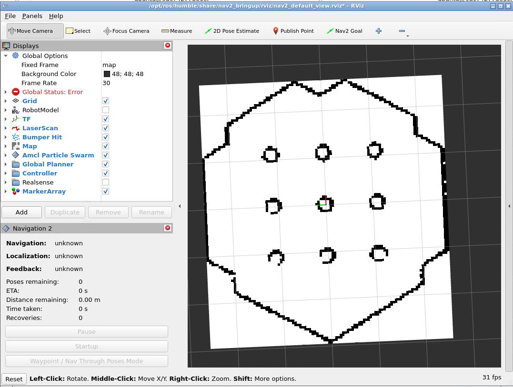

# 地図を使用したnavigation2での自律移動

## navigation2によるTurtlebot3の自律移動

ターミナルを起動し、以下のコマンドを叩いてgazeboを立ち上げ、その世界にturtlebot3を召喚しましょう。

```bash
ros2 launch turtlebot3_gazebo turtlebot3_world.launch.py
```

次に、下記のコマンドでnavigation2を起動します。

```bash
ros2 launch turtlebot3_navigation2 navigation2.launch.py use_sim_time:=True map:=$HOME/map.yaml param_file:=$HOME/Desktop/burger.yaml
```

ここでは、 `slam:=True` ではなく先ほど作成した地図のファイルを指定`map`パラメータでします。  
また、`param_file`パラメータで、ナビゲーション用のロボットのパラメータを指定します。  
現状、ROS2 Humbleではデフォルトの設定だと動かないことが確認されています。[参考](https://github.com/ROBOTIS-GIT/turtlebot3/issues/884)  

起動直後は以下のような画面になり、Rvizには白黒の地図のみが表示されていると思います。  




そこで、まずはロボットがどこにいるかをNavigation2に教えてあげる必要があります。  
Rviz上の「2D Pose Estimate」メニューからそれを実行することができます。  
その後の自律移動の方法は、SLAMをしながら自律移動を動かした際と同様に、「Nav2 Goal」メニューから行います。  

<iframe width="1280" height="720" src="https://www.youtube.com/embed/szk8N7jZN_I?si=sLMXwSX1IWgN7wWI" title="YouTube video player" frameborder="0" allow="accelerometer; autoplay; clipboard-write; encrypted-media; gyroscope; picture-in-picture; web-share" allowfullscreen></iframe>

