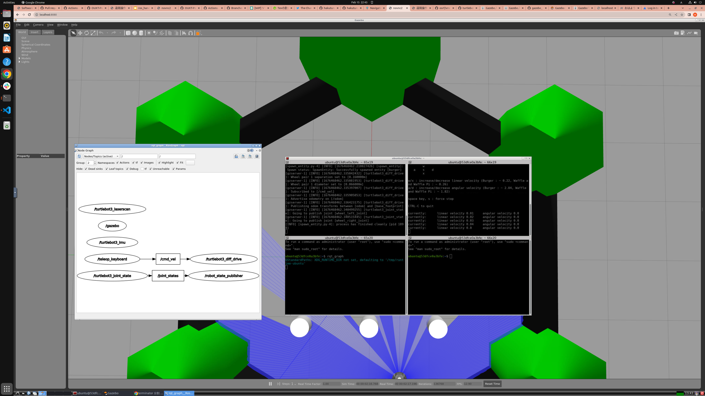

# 遠隔操作

まずは一番シンプルなキーボード入力による遠隔操作を試してみましょう。

## 操作手順
VNCでハンズオン環境に入り、以下のコマンドを実行します。

```bash
ros2 launch turtlebot3_gazebo turtlebot3_world.launch.py
```

すると、gazeboのワールドが立ち上がります。
そしてもう一つのターミナルを立ち上げ以下のコマンドを入力します。

```bash
ros2 run turtlebot3_teleop teleop_keyboard
```

上のコマンドを実行したターミナルに以下の出力がなされた場合、うまく動いています。

```bash
Control Your TurtleBot3!
---------------------------
Moving around:
        w
   a    s    d
        x

w/x : increase/decrease linear velocity (Burger : ~ 0.22, Waffle and Waffle Pi : ~ 0.26)
a/d : increase/decrease angular velocity (Burger : ~ 2.84, Waffle and Waffle Pi : ~ 1.82)

space key, s : force stop
```

w/xを押すとTurtlebot3が加減速、a/dを押すと左右旋回します。sを押すと緊急停止します。

<iframe width="1280" height="720" src="https://www.youtube.com/embed/CWrNiMq1AWo" title="YouTube video player" frameborder="0" allow="accelerometer; autoplay; clipboard-write; encrypted-media; gyroscope; picture-in-picture; web-share" allowfullscreen></iframe>

## 遠隔操作の仕組み

さて、今画面の中のTurtlebot3を操作することができましたがこのときなぜTurtlebot3を遠隔操作することができたのでしょう？  
ROS2ではrqt_graphコマンドを使うことでノードのつながりを可視化することができます。  

```bash
rqt_graph
```



`cmd_vel`トピックによって`teleop_keyboard`というノードと`turtlebot3_diff_drive`というノードがつながっていますね！  
`turtlebot3_diff_drive`ノードはgazeboのプラグインで、gazeboの世界に速度司令を送り込む役割を果たしています。  
`teleop_keyboard`ノードはROS2ノードでキー入力をもとに速度司令データを生成し、`cmd_vel`トピックを介して速度司令を送っています。

次に、`cmd_vel`トピックにどんなデータが流れているのか観察してみましょう。

ハンズオン環境でもう一つターミナルを立ち上げて、

```bash
ros2 topic echo /cmd_vel
```

と入力してみてください。

<iframe width="1280" height="720" src="https://www.youtube.com/embed/QopHoVg2i3A" title="YouTube video player" frameborder="0" allow="accelerometer; autoplay; clipboard-write; encrypted-media; gyroscope; picture-in-picture; web-share" allowfullscreen></iframe>

これで`cmd_vel`トピックにどのようなデータが流れているのかがわかりました。  
しかし、これではデータがどのように時系列で変化したかという情報はわかりません。  
rosにはそのような要望に答えるGUIツールがあります。

ハンズオン環境でもう一つターミナルを立ち上げて、

```bash
rqt
```

と打ち込んでください。  
するとGUIが開きますので、plugins -> visualization -> plotの順番に選択します。  
グラフのような画面が出てきたら、topic欄に

```
/cmd_vel/linear/x
```

と打ち込んで`+`をクリック、

```
/cmd_vel/angular/z
```

と打ち込んで`+`をクリック、してください。

`/cmd_vel`のあとについてくる`/linear/x`や`/angular/z`ってなんだよ？と思われるかと思いますが、それは`cmd_vel`トピックが`geometry_msgs/msg/Twist`型という型を持っているからです。  
`geometry_msgs/msg/Twist`型は[ここ](https://github.com/ros2/common_interfaces/blob/rolling/geometry_msgs/msg/Twist.msg)で構造が定義されており、この構造に従ったデータしか受け付けません。  
つまり`/cmd_vel/x`という値は存在しませんのでそこに値をsetしたりgetすることはできません。  
これによってROSを使うと他の人と共同開発する際の意思疎通の失敗により結合ができなくなるリスクを大きく下げることができます。  

<iframe width="1280" height="720" src="https://www.youtube.com/embed/mh2JlbrpQic" title="YouTube video player" frameborder="0" allow="accelerometer; autoplay; clipboard-write; encrypted-media; gyroscope; picture-in-picture; web-share" allowfullscreen></iframe>

