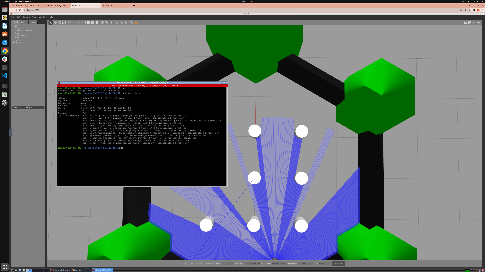

# 可視化とロギング

## laserscanの可視化

遠隔操作でロボットを動かすことはできるようになりましたが、ここまで紹介した方法ではロボットからどういうセンサデータを受信しているかは`ros2 topic echo`などのコマンドを見るしかありません。
しかし、それではカメラやLiDARといった高い次元数を持つデータを正しく送られているかを確認できません。
そこで、`rviz2`という3Dビジュアライザを使ってgazeboによってシミュレートされたセンサ情報を表すトピックを可視化してみましょう。

手順としては、まず以下のコマンドを実行し、gazeboを起動します。

```bash
ros2 launch turtlebot3_gazebo turtlebot3_world.launch.py
```

つぎに以下のコマンドを実行し、`rviz2`を起動します。

```bash
rviz2
```

rviz2を起動すると、`Frame [map] does not exist`というエラーが赤字で表示されていると思います。
いきなりエラーとは何事か？と思われるかもしれませんが、これは正常な動作です。
rviz2の描画の基準になる座標系（Fixed Frame）はデフォルトでは`map`という名前になっていますが、まだ`map`座標系を計算するノードはありません。
そのためこの状況はrviz2上ではエラーにはなっているものの、システムの挙動としては正常という状態になります。
しかしエラー状態では何も描画できないので、Fixed Frameのドロップダウンリストから`base_link`の選択肢を選びます。

次にDisplayパネルのAddをクリックし、By Topicパネルを開きます。
するとそこには現在発行されているトピックとそれに対応する可視化プラグインの一覧があります。
今回はLiDARのscanデータを可視化したいので、scanを選択してください。
下の動画に示すような赤い点群が得られたら成功です。

<iframe width="1280" height="720" src="https://www.youtube.com/embed/NMMXNz6CXwQ" title="YouTube video player" frameborder="0" allow="accelerometer; autoplay; clipboard-write; encrypted-media; gyroscope; picture-in-picture; web-share" allowfullscreen></iframe>

もし、赤い点群が得られたらDisplayパネルから可視化の設定をいじって点群の色を変えてみたり、大きさや描画方法を変更してみてください。

さらに、[前章](teleop.md)で示した遠隔操作ノードと組み合わせるとロボットの動きに合わせてLiDARの計測結果も変化しているのがわかります。

<iframe width="1280" height="720" src="https://www.youtube.com/embed/AjXtOwsTNlg" title="YouTube video player" frameborder="0" allow="accelerometer; autoplay; clipboard-write; encrypted-media; gyroscope; picture-in-picture; web-share" allowfullscreen></iframe>

## ログデータの可視化

ロボット、特に重量のある大型ロボットは試験が非常に大変です。
例えば[OUXT Polaris](https://www.ouxt.jp/)が競技に使用しているWAM-Vは組み立てに4人がかりで2~3時間程度必要です。
そんなロボットを実験する機会というのは非常に貴重であり、開発スケジュールの遅れに繋がります。
そこで重要な役割を担うのがロギングツールです。
ROS2ではrosbag2というロギングツールが採用されています。

<blockquote class="embedly-card"><h4><a href="https://github.com/ros2/rosbag2">GitHub - ros2/rosbag2</a></h4><p>Repository for implementing rosbag2 as described in its corresponding design article. rosbag2 packages are available via debian packages and thus can be installed via $ export CHOOSE_ROS_DISTRO=crystal # rosbag2 is available starting from crystal $ sudo apt-get install ros-$CHOOSE_ROS_DISTRO-ros2bag ros-$CHOOSE_ROS_DISTRO-rosbag2* Note that the above command installs all packages related to rosbag2.</p></blockquote>
<script async src="//cdn.embedly.com/widgets/platform.js" charset="UTF-8"></script>

rosbag2はデフォルトではsqlite3という形式でデータを保存しますが、性能やcdrに存在する非常につよい制約の関係上mcapという形式を推奨します。
mcapを使うためには`rosbag2_storage_mcap`パッケージのインストールが必要です。
ハンズオン環境にはすでに入っていますので追加は不要ですが、もし今後お手元のロボットで使用するときは`rosbag2_storage_mcap`のインストールを忘れないようにしましょう。

ハンズオン環境でgazeboの立ち上げを行なった後、新たにターミナルを立ち上げ、以下のコマンドを実行してrosbagのデータを保存します。
`--storage mcap`の指定を忘れるとデフォルトの形式であるsqlite3で保存が行なわれてしまうので気をつけましょう。

```bash
ros2 bag record -a --storage mcap
```

もうロギングはいいかな、となったところで`ctrl+C`でrecordを終了してください。  
すると、rosbag2_(日付、時刻)というような名前のディレクトリができているはずです。  
そのディレクトリ内部にある.mcapファイルがrosbagデータの本体です。  
このファイルの中に何時何分何秒にこのようなデータがpublishされたという記録が残っており、それによって過去の実験データを再生できます。  

<iframe width="1280" height="720" src="https://www.youtube.com/embed/XHF1vQSpPuo" title="YouTube video player" frameborder="0" allow="accelerometer; autoplay; clipboard-write; encrypted-media; gyroscope; picture-in-picture; web-share" allowfullscreen></iframe>

recordが終わったら`*.mcap`拡張子のファイルがあるディレクトリにcdした後に以下のコマンドを実行して、どんなデータが記録されたか確認してみましょう。

```bash
ros2 bag info .
```



```bash
Files:             rosbag2_2023_02_21-12_21_13_0.mcap
Bag size:          747.4 KiB
Storage id:        mcap
Duration:          5.467s
Start:             Feb 21 2023 12:21:13.380 (1676982073.380)
End:               Feb 21 2023 12:21:18.848 (1676982078.848)
Messages:          1799
Topic information: Topic: /clock | Type: rosgraph_msgs/msg/Clock | Count: 55 | Serialization Format: cdr
                   Topic: /tf | Type: tf2_msgs/msg/TFMessage | Count: 265 | Serialization Format: cdr
                   Topic: /events/write_split | Type: rosbag2_interfaces/msg/WriteSplitEvent | Count: 0 | Serialization Format: cdr
                   Topic: /imu | Type: sensor_msgs/msg/Imu | Count: 1092 | Serialization Format: cdr
                   Topic: /odom | Type: nav_msgs/msg/Odometry | Count: 160 | Serialization Format: cdr
                   Topic: /rosout | Type: rcl_interfaces/msg/Log | Count: 10 | Serialization Format: cdr
                   Topic: /joint_states | Type: sensor_msgs/msg/JointState | Count: 160 | Serialization Format: cdr
                   Topic: /performance_metrics | Type: gazebo_msgs/msg/PerformanceMetrics | Count: 28 | Serialization Format: cdr
                   Topic: /parameter_events | Type: rcl_interfaces/msg/ParameterEvent | Count: 0 | Serialization Format: cdr
                   Topic: /robot_description | Type: std_msgs/msg/String | Count: 1 | Serialization Format: cdr
                   Topic: /tf_static | Type: tf2_msgs/msg/TFMessage | Count: 1 | Serialization Format: cdr
                   Topic: /scan | Type: sensor_msgs/msg/LaserScan | Count: 27 | Serialization Format: cdr
```

上記のような出力が得られました。  
`ros2 bag info`コマンドを使えば、トピックのロギング漏れなどを確認できます。  

`*.mcap`拡張子のファイルがあるディレクトリに存在するmetada.yamlにはTopicのQoSに関する情報などのメタデータが記録されています。  

では次に、`ros2 bag play`コマンドを使用してrosbagに記録されたデータを再生してみましょう。

以下のコマンドでrvizを立ち上げます。

```bash
rviz2 -d /home/ubuntu/.rviz2/rosbag_play.rviz
```

`-d`オプションにはrvizの設定ファイルのパスを指定しますこれによってどのトピックの情報を可視化するかなどを毎回設定する必要がなくなります。

次に、`ros2 bag info`コマンドを実行したときと同じディレクトリで下記のコマンドを実行します。

```bash
ros2 bag play --storage mcap
```

するとrosbagが再生され記録されていたデータがrviz上に可視化されました。

<iframe width="1280" height="720" src="https://www.youtube.com/embed/KUFNgBE3uUc" title="YouTube video player" frameborder="0" allow="accelerometer; autoplay; clipboard-write; encrypted-media; gyroscope; picture-in-picture; web-share" allowfullscreen></iframe>
