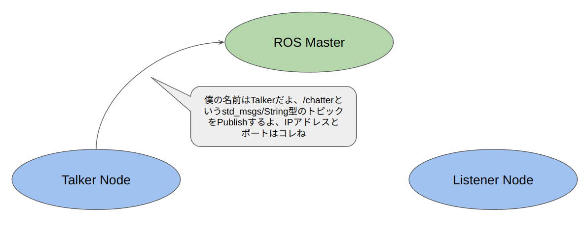
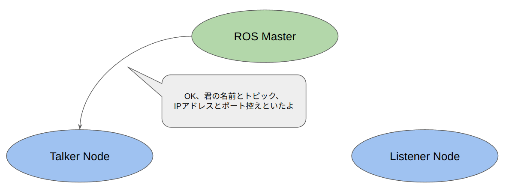
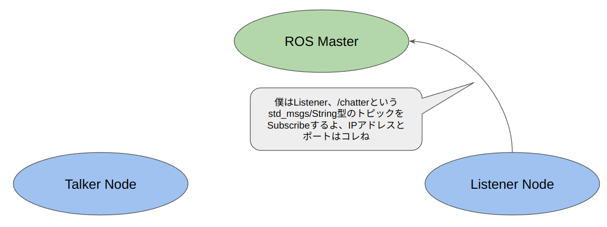
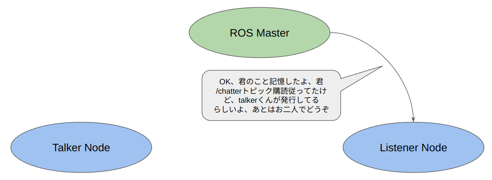
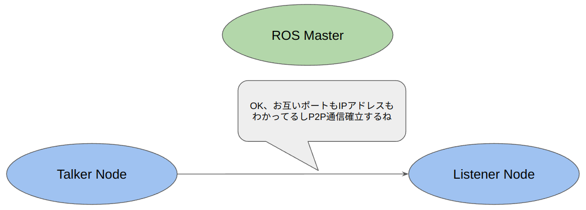
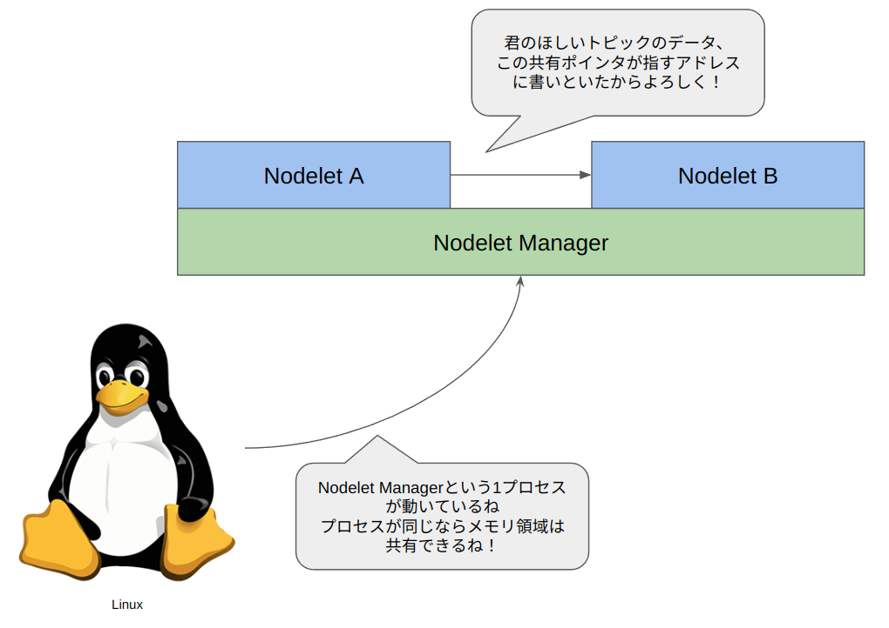

# ROS2とは？

## ROS1とROS2の関係性
まず、ROSとはなにか？ということについてわかりやすい資料がこちら

<iframe src="https://docs.google.com/presentation/d/e/2PACX-1vQvX8nOOldvSrj9L7rbCSRcZuO4d4oCj_-KuVAo85D8urMcMmoIJIpqZDmme514_nvCcb4uaGTKdiut/embed?start=false&loop=false&delayms=3000" frameborder="0" width="960" height="569" allowfullscreen="true" mozallowfullscreen="true" webkitallowfullscreen="true"></iframe>

ロボットのソフトウェアは

- 密結合になりがち（ちゃんと動くシステムを作ろうとすると数万行になるのは当たり前）
- イベントドリブンになりがち（〇〇のセンサーに反応があったら〇〇する）という

性質があります。ROSを使うことによって、使いやすいロボットソフトウェアを作ることができます。  
具体的なメリットを上げておくと

- 同じハードウェアを使っている人がいた場合、開発期間が短縮できて本質的な研究活動に時間を使える
- 部品化ができるので「伝わる秘伝のタレ」化しにくい
- 部品のデバッグをしっかりしておけばデバッグ工数が削減できる

しかし、ROS1にはその延長線上で開発を続けていては解決困難な問題があり、それを解決するべく1から再開発されたのがROS2です。  
ROSの最後のディストリビューションであるNoeticは[2025年にサポート終了が予告](http://wiki.ros.org/Distributions)されており、そろそろROS2に移行しておかないとせっかく作った開発資産が使えなくなってしまうリスクがあります。

## ROS2が作られた理由

### ライセンス問題
ROS1時代はBSDライセンス等でコアライブラリが提供されてきました.
しかし、コアライブラリの一部にコピーレフトなライセンスに依存する可能性のあるものが含まれていたり、初期の開発過程がトレースされていなかったことによりライセンスに関して
不明瞭な部分が存在しました.
商用アプリケーション開発に於いてはこれは大きな法的問題に発生しうる可能性があり、1からROS2を開発する大きな要員の1つになりました.

ROS2からは[Apache 2.0ライセンス](https://licenses.opensource.jp/Apache-2.0/Apache-2.0.html)が採用され、それに準拠するようにコアライブラリ
の開発工程が管理されているため安心して商用利用することが可能です.

<details>
<summary>Apache 2.0 License</summary>

```

                                 Apache License
                           Version 2.0, January 2004
                        http://www.apache.org/licenses/

   TERMS AND CONDITIONS FOR USE, REPRODUCTION, AND DISTRIBUTION

   1. Definitions.

      "License" shall mean the terms and conditions for use, reproduction,
      and distribution as defined by Sections 1 through 9 of this document.

      "Licensor" shall mean the copyright owner or entity authorized by
      the copyright owner that is granting the License.

      "Legal Entity" shall mean the union of the acting entity and all
      other entities that control, are controlled by, or are under common
      control with that entity. For the purposes of this definition,
      "control" means (i) the power, direct or indirect, to cause the
      direction or management of such entity, whether by contract or
      otherwise, or (ii) ownership of fifty percent (50%) or more of the
      outstanding shares, or (iii) beneficial ownership of such entity.

      "You" (or "Your") shall mean an individual or Legal Entity
      exercising permissions granted by this License.

      "Source" form shall mean the preferred form for making modifications,
      including but not limited to software source code, documentation
      source, and configuration files.

      "Object" form shall mean any form resulting from mechanical
      transformation or translation of a Source form, including but
      not limited to compiled object code, generated documentation,
      and conversions to other media types.

      "Work" shall mean the work of authorship, whether in Source or
      Object form, made available under the License, as indicated by a
      copyright notice that is included in or attached to the work
      (an example is provided in the Appendix below).

      "Derivative Works" shall mean any work, whether in Source or Object
      form, that is based on (or derived from) the Work and for which the
      editorial revisions, annotations, elaborations, or other modifications
      represent, as a whole, an original work of authorship. For the purposes
      of this License, Derivative Works shall not include works that remain
      separable from, or merely link (or bind by name) to the interfaces of,
      the Work and Derivative Works thereof.

      "Contribution" shall mean any work of authorship, including
      the original version of the Work and any modifications or additions
      to that Work or Derivative Works thereof, that is intentionally
      submitted to Licensor for inclusion in the Work by the copyright owner
      or by an individual or Legal Entity authorized to submit on behalf of
      the copyright owner. For the purposes of this definition, "submitted"
      means any form of electronic, verbal, or written communication sent
      to the Licensor or its representatives, including but not limited to
      communication on electronic mailing lists, source code control systems,
      and issue tracking systems that are managed by, or on behalf of, the
      Licensor for the purpose of discussing and improving the Work, but
      excluding communication that is conspicuously marked or otherwise
      designated in writing by the copyright owner as "Not a Contribution."

      "Contributor" shall mean Licensor and any individual or Legal Entity
      on behalf of whom a Contribution has been received by Licensor and
      subsequently incorporated within the Work.

   2. Grant of Copyright License. Subject to the terms and conditions of
      this License, each Contributor hereby grants to You a perpetual,
      worldwide, non-exclusive, no-charge, royalty-free, irrevocable
      copyright license to reproduce, prepare Derivative Works of,
      publicly display, publicly perform, sublicense, and distribute the
      Work and such Derivative Works in Source or Object form.

   3. Grant of Patent License. Subject to the terms and conditions of
      this License, each Contributor hereby grants to You a perpetual,
      worldwide, non-exclusive, no-charge, royalty-free, irrevocable
      (except as stated in this section) patent license to make, have made,
      use, offer to sell, sell, import, and otherwise transfer the Work,
      where such license applies only to those patent claims licensable
      by such Contributor that are necessarily infringed by their
      Contribution(s) alone or by combination of their Contribution(s)
      with the Work to which such Contribution(s) was submitted. If You
      institute patent litigation against any entity (including a
      cross-claim or counterclaim in a lawsuit) alleging that the Work
      or a Contribution incorporated within the Work constitutes direct
      or contributory patent infringement, then any patent licenses
      granted to You under this License for that Work shall terminate
      as of the date such litigation is filed.

   4. Redistribution. You may reproduce and distribute copies of the
      Work or Derivative Works thereof in any medium, with or without
      modifications, and in Source or Object form, provided that You
      meet the following conditions:

      (a) You must give any other recipients of the Work or
          Derivative Works a copy of this License; and

      (b) You must cause any modified files to carry prominent notices
          stating that You changed the files; and

      (c) You must retain, in the Source form of any Derivative Works
          that You distribute, all copyright, patent, trademark, and
          attribution notices from the Source form of the Work,
          excluding those notices that do not pertain to any part of
          the Derivative Works; and

      (d) If the Work includes a "NOTICE" text file as part of its
          distribution, then any Derivative Works that You distribute must
          include a readable copy of the attribution notices contained
          within such NOTICE file, excluding those notices that do not
          pertain to any part of the Derivative Works, in at least one
          of the following places: within a NOTICE text file distributed
          as part of the Derivative Works; within the Source form or
          documentation, if provided along with the Derivative Works; or,
          within a display generated by the Derivative Works, if and
          wherever such third-party notices normally appear. The contents
          of the NOTICE file are for informational purposes only and
          do not modify the License. You may add Your own attribution
          notices within Derivative Works that You distribute, alongside
          or as an addendum to the NOTICE text from the Work, provided
          that such additional attribution notices cannot be construed
          as modifying the License.

      You may add Your own copyright statement to Your modifications and
      may provide additional or different license terms and conditions
      for use, reproduction, or distribution of Your modifications, or
      for any such Derivative Works as a whole, provided Your use,
      reproduction, and distribution of the Work otherwise complies with
      the conditions stated in this License.

   5. Submission of Contributions. Unless You explicitly state otherwise,
      any Contribution intentionally submitted for inclusion in the Work
      by You to the Licensor shall be under the terms and conditions of
      this License, without any additional terms or conditions.
      Notwithstanding the above, nothing herein shall supersede or modify
      the terms of any separate license agreement you may have executed
      with Licensor regarding such Contributions.

   6. Trademarks. This License does not grant permission to use the trade
      names, trademarks, service marks, or product names of the Licensor,
      except as required for reasonable and customary use in describing the
      origin of the Work and reproducing the content of the NOTICE file.

   7. Disclaimer of Warranty. Unless required by applicable law or
      agreed to in writing, Licensor provides the Work (and each
      Contributor provides its Contributions) on an "AS IS" BASIS,
      WITHOUT WARRANTIES OR CONDITIONS OF ANY KIND, either express or
      implied, including, without limitation, any warranties or conditions
      of TITLE, NON-INFRINGEMENT, MERCHANTABILITY, or FITNESS FOR A
      PARTICULAR PURPOSE. You are solely responsible for determining the
      appropriateness of using or redistributing the Work and assume any
      risks associated with Your exercise of permissions under this License.

   8. Limitation of Liability. In no event and under no legal theory,
      whether in tort (including negligence), contract, or otherwise,
      unless required by applicable law (such as deliberate and grossly
      negligent acts) or agreed to in writing, shall any Contributor be
      liable to You for damages, including any direct, indirect, special,
      incidental, or consequential damages of any character arising as a
      result of this License or out of the use or inability to use the
      Work (including but not limited to damages for loss of goodwill,
      work stoppage, computer failure or malfunction, or any and all
      other commercial damages or losses), even if such Contributor
      has been advised of the possibility of such damages.

   9. Accepting Warranty or Additional Liability. While redistributing
      the Work or Derivative Works thereof, You may choose to offer,
      and charge a fee for, acceptance of support, warranty, indemnity,
      or other liability obligations and/or rights consistent with this
      License. However, in accepting such obligations, You may act only
      on Your own behalf and on Your sole responsibility, not on behalf
      of any other Contributor, and only if You agree to indemnify,
      defend, and hold each Contributor harmless for any liability
      incurred by, or claims asserted against, such Contributor by reason
      of your accepting any such warranty or additional liability.

   END OF TERMS AND CONDITIONS

   APPENDIX: How to apply the Apache License to your work.

      To apply the Apache License to your work, attach the following
      boilerplate notice, with the fields enclosed by brackets "[]"
      replaced with your own identifying information. (Don't include
      the brackets!)  The text should be enclosed in the appropriate
      comment syntax for the file format. We also recommend that a
      file or class name and description of purpose be included on the
      same "printed page" as the copyright notice for easier
      identification within third-party archives.

   Copyright [yyyy] [name of copyright owner]

   Licensed under the Apache License, Version 2.0 (the "License");
   you may not use this file except in compliance with the License.
   You may obtain a copy of the License at

       http://www.apache.org/licenses/LICENSE-2.0

   Unless required by applicable law or agreed to in writing, software
   distributed under the License is distributed on an "AS IS" BASIS,
   WITHOUT WARRANTIES OR CONDITIONS OF ANY KIND, either express or implied.
   See the License for the specific language governing permissions and
   limitations under the License.
```

</details>

### 単一障害点の排除
ROS1時代にはros masterというプロセスがrosparamの管理、新規ノードの発見やトピック間の接続という重要な仕事を担っていました.

**ros masterの役割の一例、TalkerとListenerノードの接続**







そのため、ROS1アプリケーションに於いてros masterが稼働中のシステムで落ちてしまうとシステム全体が機能不全になる可能性があります.
単一障害点の排除は長期間運用されるアプリケーションに於いては非常に重要な課題の1つです.
ros masterの挙動に関する日本語ドキュメントは[こちら](http://wiki.ros.org/ja/Master)にあります.

### 効率的なデータ転送
ROS1時代に存在した[nodelet](http://wiki.ros.org/nodelet)という仕組みをご存知でしょうか？
nodeletは通常TCP/IPパケット通信により実現されるROSのトピック通信を共有ポインタを用いたゼロコピー通信に置き換えます.
この際、nodeletはnodelet_managerにロードされる共有ライブラリとして実装されます.
この仕組みをROS2向けに再設計したのが後述するROS2におけるコンポーネント指向であり、これを使用することで非常に高速にデータ通信が可能です.


### Windows対応
ROS1はLinuxにかなり依存しており、Windowsで動かすにはWSLを使ったりと工夫が必要でした.
研究開発や、スタンドアローンなロボットであればROS1のLinux依存の強さも全く問題にはならなかったのですが、
商用アプリケーションを開発するときに一般のご家庭で動いているPCのOSとして圧倒的なシェアを持っているWindowsでアプリケーションが作れないのは問題になります.
そこでROS2からはWindowsにも対応し、(一応Macにも対応はしています.)Windows上でもロボットアプリケーション開発が可能になっています.
ROS1時代にはWindowsとROS1アプリケーションの通信は[rosbridge protocol](https://github.com/biobotus/rosbridge_suite/blob/master/ROSBRIDGE_PROTOCOL.md)か
[nodejsのROSクライアント](https://github.com/RethinkRobotics-opensource/rosnodejs)くらいしかなかったので嬉しい人には嬉しい仕様かもしれません.

<blockquote class="embedly-card"><h4><a href="https://ros.org/reps/rep-2000.html#humble-hawksbill-may-2022-may-2027">REP 2000 -- ROS 2 Releases and Target Platforms (ROS.org)</a></h4><p>Note The following applies to ROS 2 releases after Foxy. Prior to Foxy, releases were made more frequently but with shorter support due to the fact that many foundational parts of ROS 2 were still being heavily developed. New ROS 2 releases will be published in a time based fashion every 12 months.</p></blockquote>
<script async src="//cdn.embedly.com/widgets/platform.js" charset="UTF-8"></script>

## ROS1とROS2の違い

### DDSの採用
DDSとは、OMGという団体が規格を策定したPub/Sub型のデータ通信システムです.
ROSと同じようにデータのスキーマも定義することが可能です.
DDSはUDPで通信を行い、ブロードキャストパケットを用いて自動的に通信相手を探索して接続することが可能です.
それによってROS1時代に存在したros masterという単一障害点がなくなりました.
(ros2daemonというros masterの類似プログラムは存在しますが、居ると通信接続が早くなるだけで時間をかければros2daemonが無くても通信相手の探索は可能です.)


図表出典：https://www.openrtm.org/openrtm/ja/doc/developersguide/advanced_rt_system_programming/dds_comm_use

DDSは規格であるため、DDSにはFast DDS / Cyclone DDSといった様々な実装が存在します.

<blockquote class="embedly-card"><h4><a href="https://github.com/eclipse-cyclonedds/cyclonedds">GitHub - eclipse-cyclonedds/cyclonedds: Eclipse Cyclone DDS project</a></h4><p>Eclipse Cyclone DDS is a very performant and robust open-source implementation of the OMG DDS specification. Cyclone DDS is developed completely in the open as an Eclipse IoT project (see eclipse-cyclone-dds) with a growing list of adopters (if you're one of them, please add your logo).</p></blockquote>
<script async src="//cdn.embedly.com/widgets/platform.js" charset="UTF-8"></script>

<blockquote class="embedly-card"><h4><a href="https://github.com/eProsima/Fast-DDS">GitHub - eProsima/Fast-DDS: The most complete DDS - Proven: Plenty of success cases.</a></h4><p>eprosima Fast DDS (formerly Fast RTPS) is a C++ implementation of the DDS (Data Distribution Service) standard of the OMG (Object Management Group). eProsima Fast DDS implements the RTPS (Real Time Publish Subscribe) protocol, which provides publisher-subscriber communications over unreliable transports such as UDP, as defined and maintained by the Object Management Group (OMG) consortium.</p></blockquote>
<script async src="//cdn.embedly.com/widgets/platform.js" charset="UTF-8"></script>

ROS2では以下のようにDDSをインストールし、環境変数を設定することで簡単にDDSの実装を切り替えることが可能です.

**Fast DDSを採用する場合**
```bash
sudo apt install ros-$ROS_DISTRO-rmw-fastrtps-cpp
export RMW_IMPLEMENTATION=rmw_fastrtps_cpp
```

**Cyclone DDSを採用する場合**
```bash
sudo apt install ros-$ROS_DISTRO-rmw-cyclonedds-cpp
export RMW_IMPLEMENTATION=rmw_cyclonedds_cpp
```

ROBOSYM 2020にfuRoの原先生が出された各種ロボットミドルウェア性能評価に関する発表[1]によると、Cyclone DDSが最も性能が良さそうであることが示されています.

<blockquote class="embedly-card"><h4><a href="https://twitter.com/ystk_hara/status/1206904096545886208?s=20">Yoshitaka HARA on Twitter: "ROS、ROS2、Ignition、Isaac のメッセージ通信の遅延と受信抜けを評価した結果です.赤字は問題箇所.ROS (TCP_NODELAY) と Ignition の性能が良い.プロットしたグラフなど、詳細は ROBOSYM2020 で発表します.ROS2 は概念.使用する DDS 実装によって、性能が大きく異なるようです.#rosjp pic.twitter.com/ir7TWUs6Wu / Twitter"</a></h4><p>ROS、ROS2、Ignition、Isaac のメッセージ通信の遅延と受信抜けを評価した結果です.赤字は問題箇所.ROS (TCP_NODELAY) と Ignition の性能が良い.プロットしたグラフなど、詳細は ROBOSYM2020 で発表します.ROS2 は概念.使用する DDS 実装によって、性能が大きく異なるようです.#rosjp pic.twitter.com/ir7TWUs6Wu</p></blockquote>
<script async src="//cdn.embedly.com/widgets/platform.js" charset="UTF-8"></script>

このデータは少し古いバージョンのものになりますが、筆者も複数のDDSを使ったところCyclone DDSが最も安定していると考えています.
Cyclone DDSやFast DDS以外にもIce Oryxといった共有メモリ転送による高速転送機能を持ったDDSが存在したりと、光る独自機能を持ったDDSも存在します.

<blockquote class="embedly-card"><h4><a href="https://github.com/eclipse-iceoryx/iceoryx">GitHub - eclipse-iceoryx/iceoryx: Eclipse iceoryx™ - true zero-copy inter-process-communication</a></h4><p>Great that you've made it to this neat Eclipse project! Let's get you started by providing a quick background tour, introducing the project scope and all you need for installation and a first running example. So first off: What is iceoryx?</p></blockquote>
<script async src="//cdn.embedly.com/widgets/platform.js" charset="UTF-8"></script>

### NodeとExecutor
Executorは[効率的なデータ転送](#_3)の項目で紹介した
ROS2（C++）ではnodeはrclcpp::Node型を継承したクラスとして実装されます.

```cpp
namespace pcl_apps
{
class CropBoxFilterComponent : public rclcpp::Node
{
public:
   PCL_APPS_CROP_BOX_FILTER_PUBLIC
   explicit CropBoxFilterComponent(const rclcpp::NodeOptions & options);
}
} // namespace pcl_spps
```

ソースコードの出典は[こちら](https://github.com/OUXT-Polaris/pcl_apps/blob/720d6cfc3562137a353f5d67f3e0f42b122025ed/pcl_apps/include/pcl_apps/filter/crop_box_filter/crop_box_filter_component.hpp#L60-L66)になります.

`PCL_APPS_CROP_BOX_FILTER_PUBLIC`はWindows/Linuxといった等マルチプラットフォームに対応したcomponentを作るための書式です.
詳細は[こちら](https://gcc.gnu.org/wiki/Visibility)を参照してください.

rclcpp::NodeクラスはROS2 Node実装に必要な機能が全て実装されており、publisher/subscriberを作ったり

```cpp
   pub_ = create_publisher<sensor_msgs::msg::PointCloud2>("~/points_filtered", 1);
   sub_ = create_subscription<sensor_msgs::msg::PointCloud2>(
      "~/points", 1, std::bind(&CropBoxFilterComponent::pointsCallback, this, std::placeholders::_1));
```
ソースコードの出典は[こちら](https://github.com/OUXT-Polaris/pcl_apps/blob/720d6cfc3562137a353f5d67f3e0f42b122025ed/pcl_apps/src/filter/crop_box_filter/crop_box_filter_component.cpp#L45-L47)になります.

rosparamを定義、取得したりすることが可能です.

```cpp
   declare_parameter("max_x", 1.0);
   get_parameter("max_x", max_x_);
```
ソースコードの出典は[こちら](https://github.com/OUXT-Polaris/pcl_apps/blob/720d6cfc3562137a353f5d67f3e0f42b122025ed/pcl_apps/src/filter/crop_box_filter/crop_box_filter_component.cpp#L29-L30)

このrclcpp::Node型を継承して作られた自作ノードを複数読み込み、複数のノードを1つのプロセスで実現するためのクラスをExecutorと呼びます.


詳細なドキュメントは[こちらのドキュメント](https://docs.ros.org/en/foxy/Concepts/About-Executors.html#)で確認できます.
Subscriberを生成する時等に登録された関数はコールバック関数としてExecutorに登録され、
「新しいデータが届いた」等のイベントをキャッチしてそれに対応するコールバック関数を呼び出すことで複数のノードを1つのプロセス上で動作させることを実現しています.
こうすることによって複数のノードで同じメモリ領域を共有できるようになり、同じExecutor上で動作しているノード間でトピックをやり取りする際には
メモリでデータをやり取りするため非常に高速で通信が可能です.
どの程度早くなるかというと、こちらの記事の計測結果を参考にすると

<blockquote class="embedly-card"><h4><a href="https://qiita.com/Ke_N_551/items/d8637ddc806f94260ba8">ROS2で同一デバイス内画像通信の遅延について知りたくて色々試した話 - Qiita</a></h4><p>単一デバイス（Ultra96）内でROS2通信を利用して画像を送受信した場合、 画像のサイズ、圧縮するか否か、使用するDDS、などを変えて画像の送受信にかかる時間を測定・評価しました. どちらかというと通信遅延そのものについての評価というより、画像を送信する際にかかる時間の評価です.ですので、圧縮画像送信の際には画像の圧縮にかかる時間も遅延時間に含んでいたりします. ...</p></blockquote>
<script async src="//cdn.embedly.com/widgets/platform.js" charset="UTF-8"></script>

非圧縮の画像データ(sensor_msgs/Image型)のデータを746msで送信することが実現できており、圧縮する時間よりも同じExecutorに載せて通信してしまうのが早いということが伺えます.

自作のROS2 NodeをExecutorに乗せる際には以下のようなコードを記述すれば可能です.

```cpp
int main(int argc, char * argv[])
{
   rclcpp::init(argc, argv);
   rclcpp::executors::MultiThreadedExecutor exec;
   rclcpp::NodeOptions options;
   auto hermite_path_planner =
      std::make_shared<hermite_path_planner::HermitePathPlannerComponent>(options);
   auto pure_pursuit_planner =
      std::make_shared<pure_pursuit_planner::PurePursuitPlannerComponent>(options);
   auto curve_planner = std::make_shared<velocity_planner::CurvePlannerComponent>(options);
   auto obstacle_planner = std::make_shared<velocity_planner::ObstaclePlannerComponent>(options);
   auto velocity_planner = std::make_shared<velocity_planner::VelocityPlannerComponent>(options);
   auto stop_planner = std::make_shared<velocity_planner::StopPlannerComponent>(options);
   auto planner_concatenator =
      std::make_shared<velocity_planner::PlannerConcatenatorComponent>(options);
   auto local_waypoint_server =
      std::make_shared<local_waypoint_server::LocalWaypointServerComponent>(options);
   exec.add_node(hermite_path_planner);
   exec.add_node(pure_pursuit_planner);
   exec.add_node(curve_planner);
   exec.add_node(obstacle_planner);
   exec.add_node(velocity_planner);
   exec.add_node(stop_planner);
   exec.add_node(planner_concatenator);
   exec.add_node(local_waypoint_server);
   exec.spin();
   rclcpp::shutdown();
   return 0;
}
```

上記のコードの出典は[こちら](https://github.com/OUXT-Polaris/hermite_path_planner/blob/d5fc4d06a54bc4b2fe282a9c1cc38b49c71bb76e/hermite_path_planner_bringup/src/hermite_path_planner_bringup.cpp#L32-L57)になります.

ちなみに、明示的にExecutorを使用しないこのような記載方法もありますが、

```cpp
int main(int argc, char * argv[])
{
   rclcpp::init(argc, argv);
   rclcpp::NodeOptions options;
   auto component = std::make_shared<pcl_apps::CropBoxFilterComponent>(options);
   rclcpp::spin(component);
   rclcpp::shutdown();
   return 0;
}
```

```cpp
rclcpp::spin(component);
```
[関数の実装を追いかける](https://github.com/ros2/rclcpp/blob/33dae5d679751b603205008fcb31755986bcee1c/rclcpp/src/rclcpp/executors.cpp#L30-L37)とひとつだけNodeを読み込んだExecutorをインスタンス化し、spinを回していることがわかります.
つまり、rclcppを使った場合全てのノードはExecutorの上で動いています.

### コンポーネント指向
[前の章](https://hakuturu583.github.io/ros_rsj_seminar/ros2/#nodeexecutor)で紹介した通り、Executorは複数のノードを１つのプロセスで起動することができますが、
[前の章](https://hakuturu583.github.io/ros_rsj_seminar/ros2/#nodeexecutor)の書き方ではコンパイル時に全てのノード構成を決めておかなければなりません.
つまり、バイナリ配布したパッケージのノード構成を実行時に切り替えたりすることができません.
動的にExecutorにコンポーネントを読み込ませるのを可能にする修法がコンポーネント指向です.
コンポーネント指向のノードを記述するには[前の章](https://hakuturu583.github.io/ros_rsj_seminar/ros2/#nodeexecutor)で記述したとおりにrclcpp::Node型を継承してのノードのクラスを実装した後、

```cpp
#include <rclcpp_components/register_node_macro.hpp>
RCLCPP_COMPONENTS_REGISTER_NODE(scan_segmentation::ScanSegmentationComponent)
```

のマクロを使用して「このクラスはコンポーネントである」という情報をマクロで記録し、

```cmake
rclcpp_components_register_nodes(scan_segmentation_component
  "scan_segmentation::ScanSegmentationComponent")
```

CMakeLists.txtに上記の変更を加えament_cmakeのシステムにC++のマクロで登録したクラスがどの共有ライブラリに入っているかという情報を記録します.

サンプルコードは[こちら](https://github.com/OUXT-Polaris/scan_segmentation/blob/1327a54ab14cc6f5bd8b5aea462714062134c458/src/scan_segmentation_component.cpp#L349)と
[こちら](https://github.com/OUXT-Polaris/scan_segmentation/blob/1327a54ab14cc6f5bd8b5aea462714062134c458/CMakeLists.txt#L44-L45)に有ります.

出来上がったコンポーネントは後述する[ros2 launch](https://hakuturu583.github.io/ros_rsj_seminar/ros2/#ros2-launch)を使用して動的に立ち上げることができます.

### ros2 launchによるより柔軟な起動手段の提供

ROS2ではlaunchファイルがPythonになるという言説が有りますが、筆者はこれは誤りであると考えます.
ROS2のPython形式のlaunchファイルはあくまでROS1時代にあったroslaunch APIの後継であり
xml形式やyaml形式のlaunchファイルがROS1時代のxml形式のlaunchファイルの後継であると考えます.

python形式でlaunchファイルが記述できるようになったことでros2 launchは
- 10秒後にあるノードを落とす
- あるノードを立ち上げて準備ができてから次のノードを立ち上げる
といった複雑な起動シーケンスもlaunchファイルで記述できるようになりました.

様々なケースがあるので、詳細は省きますが、最も一般的なros2 componentを読み込むlaunchファイルのサンプルを示しておきます.

```python
def generate_launch_description():
      container = ComposableNodeContainer(
         name='preception_bringup_container',
         namespace='perception',
         package='rclcpp_components',
         executable='component_container_mt',
         composable_node_descriptions=[
            # getImageDecompressorComponent('front_camera'),
            # getImageRectifyComponent('front_camera'),
            getScanSgementationComponent(),
            getCropHullFilterComponent(),
            getPointCloudToLaserScanComponent(),
            getRadiusOutlierRemovalComponent('front_lidar'),
            getRadiusOutlierRemovalComponent('rear_lidar'),
            getRadiusOutlierRemovalComponent('right_lidar'),
            getRadiusOutlierRemovalComponent('left_lidar'),
            getPointsTransformComponent('front_lidar'),
            getPointsTransformComponent('rear_lidar'),
            getPointsTransformComponent('right_lidar'),
            getPointsTransformComponent('left_lidar'),
            getPointsConcatenateComponent(),
            getCostmapCalculatorComponent(),
            getCostmapfilterComponent(),
            getCostmapinterpolationComponent()                
         ],
         output='screen'
      )
      return launch.LaunchDescription([
         container
      ])


def getPointsTransformComponent(lidar_name):
   config_directory = os.path.join(
      ament_index_python.packages.get_package_share_directory('perception_bringup'),
      'config')
   param_config = os.path.join(config_directory, lidar_name+'_points_transform.yaml')
   with open(param_config, 'r') as f:
      params = yaml.safe_load(f)[lidar_name + '_points_transform_node']['ros__parameters']
   component = ComposableNode(
      package='pcl_apps',
      plugin='pcl_apps::PointsTransformComponent',
      namespace='/perception/'+lidar_name,
      name='points_transform_node',
      remappings=[('input', lidar_name+'/points_raw'), ('output', 'points_raw/transformed')],
      parameters=[params])
   return component
```

こちらのサンプルコードの出典は[こちら](https://github.com/OUXT-Polaris/perception_bringup/blob/master/launch/perception_bringup.launch.py)になります
上記のようなコードを記述することで、自作のComponentを読み込ませてROS2 Applicationを立ち上げることが可能になります.
